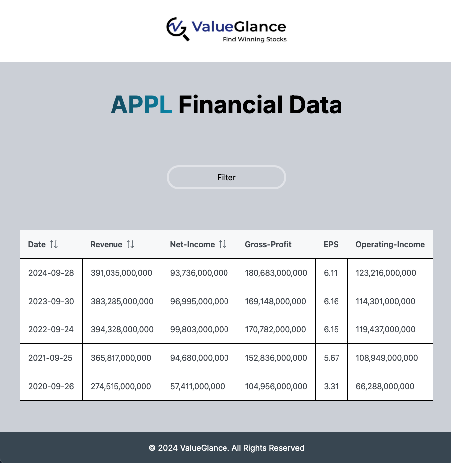

# Financial Filtering App 📊

## Description 📝
This Financial Filtering App is a user-friendly tool designed to help users analyze financial data with ease. It allows users to filter key metrics such as Start Year, End Year, Revenue, and Net Income dynamically, offering precise control over the displayed data. With intuitive input fields, a responsive design, and smooth transitions, the app ensures a seamless user experience. 

## Features of the App 🚀
<ol>
    <li>Fetch the data from the API endpoint and display it in as a table.
    <li>Allow users to filter the data using the following criteria:
        <ol>
            <li>Date Range
            <li>Revenue
            <li>Net Income
        </ol>
    <li>Allow users to sort the table by ascending and descending order
    <li>App is responsive and mobile friendly
</ol>

## [Click here to review](https://movie-reviews-app-9dd1875b7f4b.herokuapp.com/) 👈🏼

## Libraries Used👨🏻‍💻
1. PrimeReact
2. HamburgerReact

## Language Used 📝

